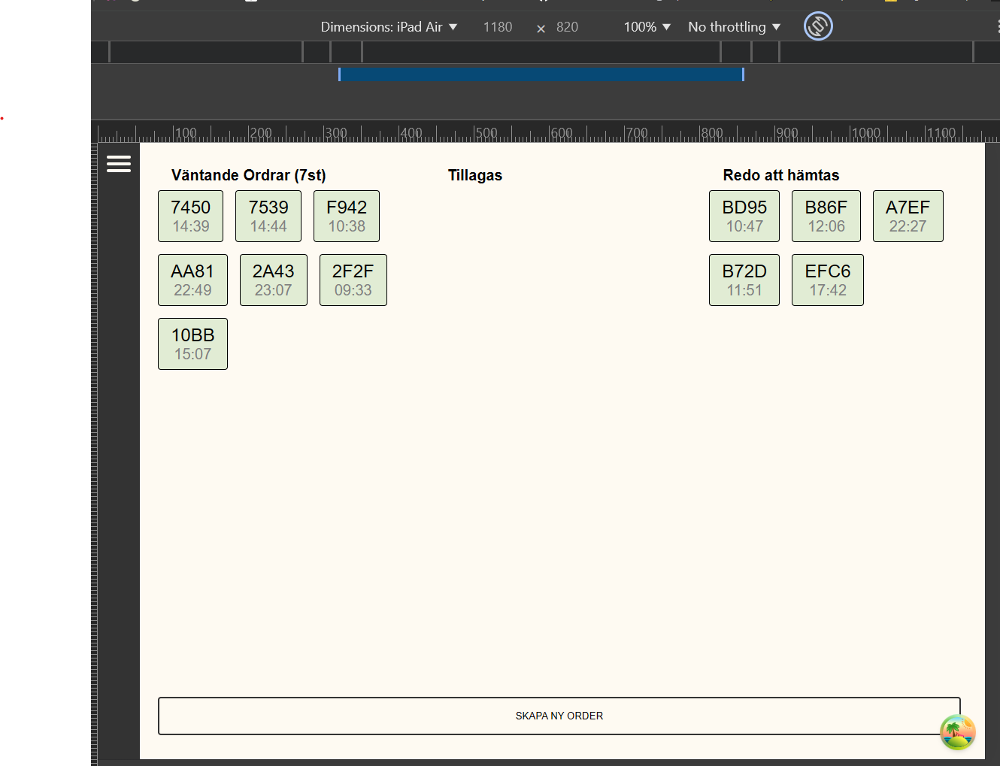

# **GRUPPEXAMINATION RUBY RABBITS:**

 

### **KURS:**

_"FULLSTACK"_

 

### **GRUPPMEDLEMMAR:**

KIM, JOHAN OCH MAGNUS

 
 

# HAPPYMESS: _"Join the mess!"_

Vårt koncept är glass i stora lass! Vi kom tidigt fram till att glass kan bli en lekfull sida och kul att utveckla. Vi tog inspiration från "rubber hose" animeringar.
Designen har varit en iterativ process som vi fortfarande håller på att iterera. Det är svårt att uppskatta tid så vissa saker som animering har inte hunnits med.

## VÅR UPPDELNING:

Vi har skapat två olika applikationer då en anställd och en kund har olika behov. Kundsidan fungerar på alla skärmstorlekar och där har vi fokuserat en hel del på design.

Anställdas sida tänker vi fungerar som ett intranät. Den är helt och hållet byggd med funktionalitet i åtanke. Designen är meningen att vara sparsam och är ej heller gjord för alla skärmstorlekar.

Vi bestämde att anställda använder en ipad-air i horisontellt/landskapsläge för att nyttja applikationen.
Det betyder att 1180px är den storlek som gäller för anställda.
Vi rekommenderar att ni väljer ipad-air i developer-mode och flippar till horizontellt läge.

 

 

# **Kundernas sida hittar du här:**

> [!TIP] KUNDSIDA
> [**HAPPYMESS: KUND**](https://drpn0wxpzl77r.cloudfront.net)

 

## **Kundsidan:**

När du navigerar till Happymess kommer du direkt till menysidan som har 3 sektioner. Vi har delat upp produkterna i kategorierna Icecream och Milkshake.
Kunder kan välja vilken storlek de ska köpa. Finns inte glassen i kundkorgen visas en köp-knapp men är den i korgen visas istället en inkrement-knapp med antal som redan ligger i korgen.

Varukorgen är inte interaktiv förens något ligger i den.

Vill man gå vidare finns länken i varukorgen som skickar dig till en sida för att bekräfta. Väl där kan kund lägga kommentar och se över sin beställning.

Bekräftas köpet får du se status på ditt köp samt ordernummer.

Om du inte är inloggad så får man skriva upp sitt ordernummer själv men inloggade har sina 5 senaste köp sparade i sin profil och kan där se status.

Om du ångrar dig så kan du annulera köpet alternativt göra ändringar fram tills det att "kocken" börjar tillaga. Detta är kopplat med websocket. Man kan inte ändra till en tom order, varken som kund eller employee. Om endast en item är kvar på order så är knappen disabled. Istället bör man annulera ordern helt.

Kunder kan skapa en egen användare och logga in.

Som registrerad kund kan du på profilsidan ändra lösenord, välja betalningssätt och andra kunduppgifter. Här kan du också som sagt se dina 5 senaste avslutade beställningar och 2 aktiva. Klickar man på ordernummer så ser man ordern och status.

 

## **Anställdas sida hittar du här:**

> [!TIP] ANSTÄLLDA:
> [**HAPPYMESS: ANSTÄLLD**](https://dxcrvzvfdmi0n.cloudfront.net)

OBS: Ni får användaruppgifter från oss.

 

## Anställdas sida:

Vi tänker att anställdas sida existerar bara som en app lokalt på restuarangen. Man kan inte skapa sin egen profil utan det måste admin göra. Ni får inloggning av oss.

Vi har tre typer av användare. Employee, manager och admin.

Employee kan inte göra ändringar på produkter utan du behöver högre access för att ens få valet att navigera till den sidan.

### Som employee kan du:

-   Lägga order. Dvs "stå i kassan".
-   Editera order. Detta gör du genom att klicka på ett ordernummer antingen från kockvyn eller från kassan. Du kan ändra antal i order eller annulera ordern helt.
-   Som kock blir du förvarnad om en kund har skickat med en kommentar. Du ser det genom att bordern på korten som ligger är röd och har en notepad-ikon. Klickar du på det kortet så ser du kommentaren i rött.
-   Endast en order som tillagas visas i taget.
-   När kund kommer för att hämta sin order så ligger färdiga ordrar i kategorin "Redo att hämtas". Klickar man på ett sådant kort har man valet att "ge till kund". Detta markerar ordern som avslutad.
-   Inkommande ordrar och statusuppdateringar ser man direkt. Man behöver inte uppdatera sidan själv. Detta görs via websocket.

### Som admin/manager kan du:

-   Allt som employee kan.
-   Lägga till nya produkter med all information som behövs. Inklusive bild.
-   Du kan också editera produkterna i databasen.
-   Meningen var att vi ska visa lagersaldo och någon form av admin-dashboard som visar populära produkter osv. Men tiden sprang ifrån oss.
